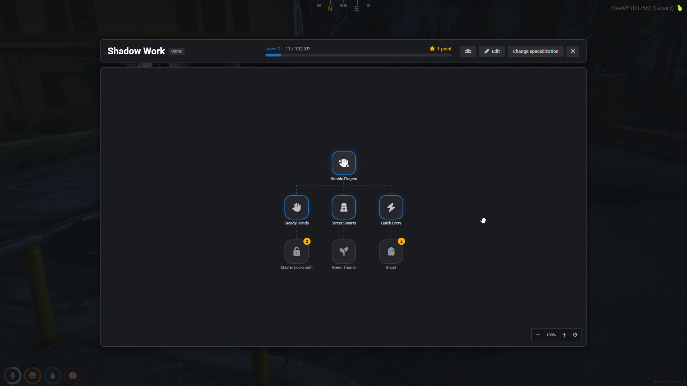
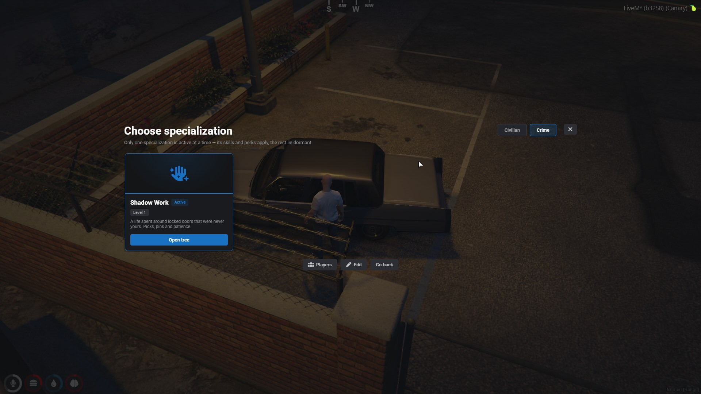
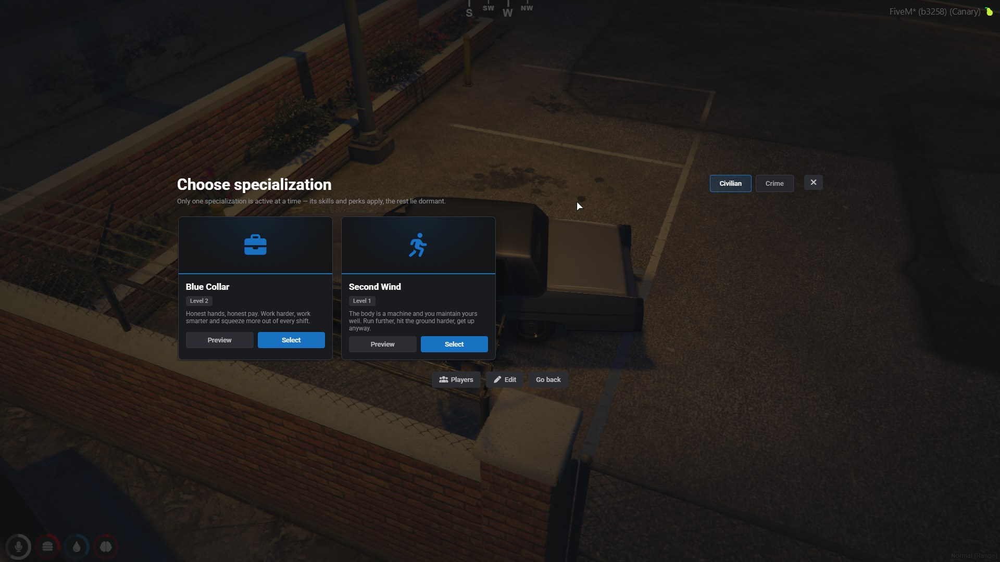
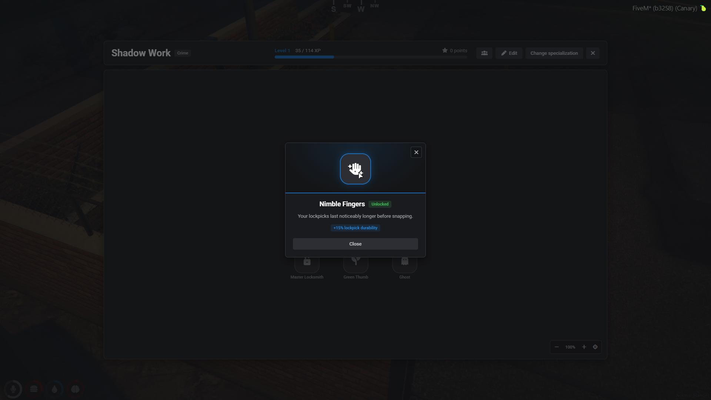
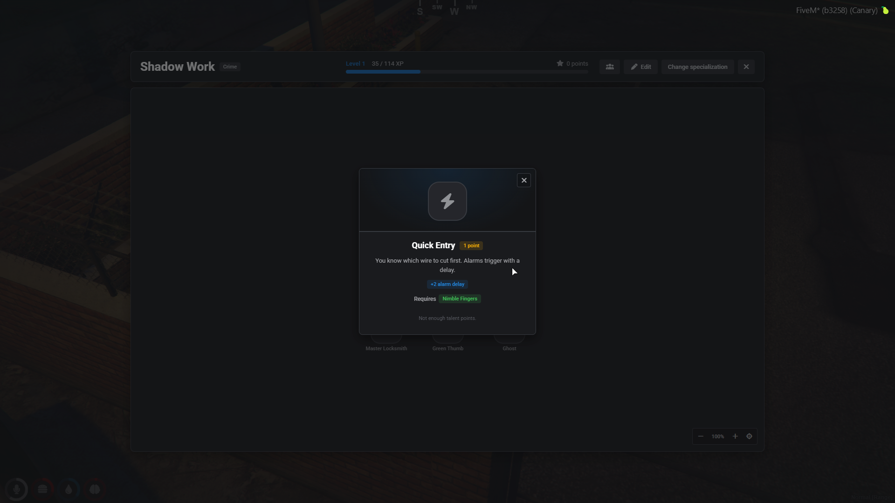
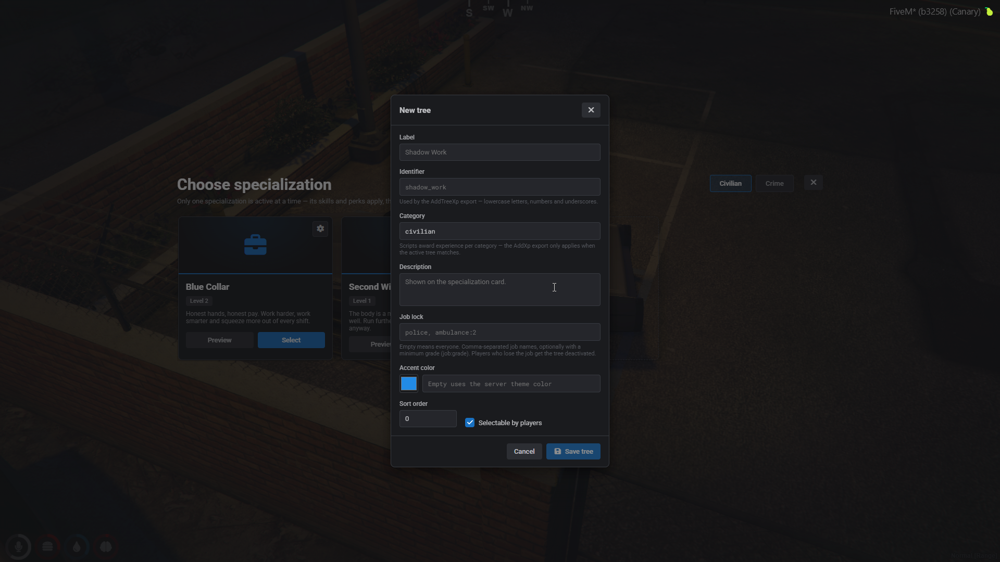
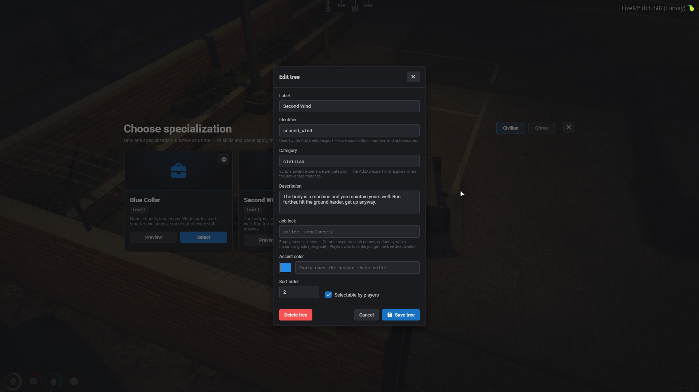
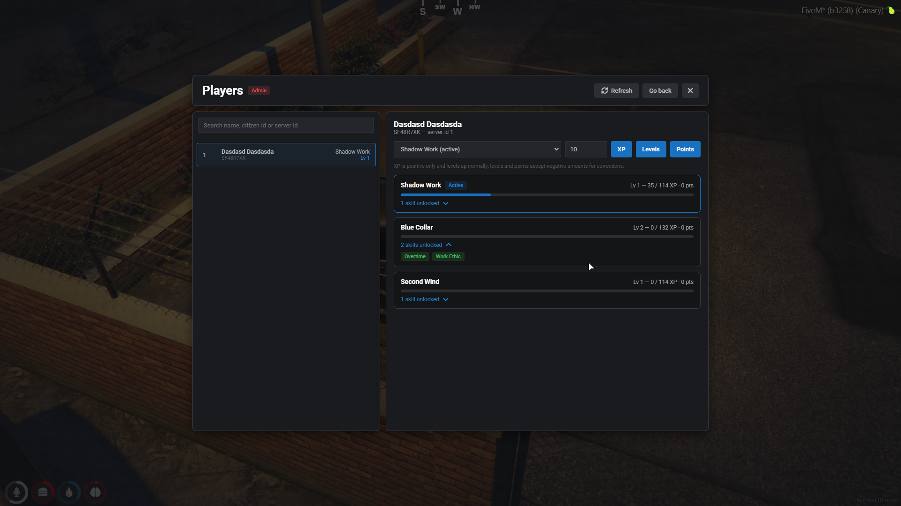
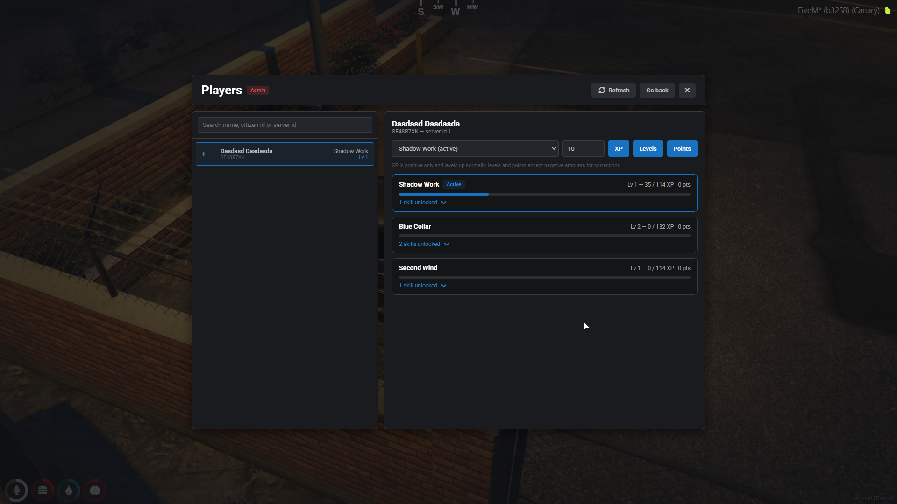

# qbx_skills

Skill tree progression for [Qbox](https://github.com/Qbox-project). Players choose a
specialization, earn experience from activities around the server, spend the talent points they
gain on level up, and unlock skills that other resources query through exports. Admins edit the
trees live in-game — nodes, links, descriptions, icons, bonuses and whole trees — no restarts,
no config files.



## Showcase

[Video: lockpicking a car for crime XP](docs/media/showcase-lockpicking.mp4) — the first
attempt awards nothing because the active specialization is a civilian tree and
`activeTreePerCategory` is disabled; after activating the crime tree the same lockpick pays
15 XP. That is the category system doing its job — XP only flows into a matching active tree.

| | |
| --- | --- |
|  |  |
|  |  |

## Features

- **Specializations** — any number of trees grouped into categories (crime, civilian, ...).
  One tree is active per player — or one per category with `activeTreePerCategory` — and the
  rest lie dormant until selected.
- **Levels and talent points** — every level up grants a talent point and raises the
  experience needed for the next level. Points are spent to unlock skills in the tree.
- **Skill links** — skills connect into a tree; a skill only unlocks once a parent is owned
  (`linkRequirement = 'all'` requires every parent).
- **Live editor** — players with the qbx_core `admin` permission get an Edit button: add,
  drag and delete skills, draw or remove links by clicking them, change labels, descriptions,
  costs, Font Awesome icons and bonus values, create or retire whole trees, and undo any of
  it. Changes are stored in the database and pushed to every online player instantly.
- **Admin player panel** — every online player with their active specializations, per-tree
  levels, points and unlocked skills, plus controls to grant XP, levels or talent points.
- **Built-in stat perks** — `max_health`, `max_armour` and `stamina` bonus keys are applied
  to the ped by qbx_skills itself and published to huds via the `qbx_skills_stats` statebag.
  Bridges for qbx_medical and randol_medical keep the perks applied through revives, respawns
  and check-ins; any other medical script gets a one-file bridge from the template in `bridge/`.
- **Job-locked trees** — restrict a tree to jobs (with minimum grades) in the editor; the
  lock is enforced server-side and the tree auto-deactivates when the player loses the job.
- **Logging** — every unlock, level up, tree switch, admin grant and editor change goes
  through `lib.logger`.
- **Radial menu** — the UI opens from the ox_lib radial menu, no command.
- **ox_lib theming** — the UI follows the `ox:primaryColor` / `ox:primaryShade` convars, with
  an optional accent color per tree.

## The editor

| | |
| --- | --- |
|  |  |
|  |  |

Everything about a tree is data: click an empty grid cell to add a skill, drag skills around,
click a link line to cut it, use the icon picker (any Font Awesome solid icon), attach bonus
key/value pairs, and lock trees to jobs with `police, ambulance:2` syntax. The admin Players
panel inspects and adjusts any online player's progression.



## Install

1. Ensure the resource after `qbx_core` (inside a `[qbx]` folder, `ensure [qbx]` covers it).
2. Build the UI once: `cd web && bun install && bun run build` (any npm-compatible tool works).
3. The tables in `skills.sql` are created automatically on first start, along with three
   example trees from `skills_seed.sql` (disable with `seedExampleTrees = false`). If the
   database user cannot `CREATE`, run the .sql files by hand.

## Configuration

`config/shared.lua`:

| option | default | meaning |
| --- | --- | --- |
| `xp.base` | `100` | experience for the first level |
| `xp.growth` | `1.15` | each level multiplies the next requirement |
| `xp.maxLevel` | `50` | level cap per tree |
| `pointsPerLevel` | `1` | talent points granted per level up |
| `linkRequirement` | `'any'` | `'any'` or `'all'` parents required to unlock a child |
| `activeTreePerCategory` | `false` | one active tree per category (crime + civilian at once) instead of one total |
| `abandonResetsProgress` | `false` | switching away from a tree wipes it |
| `switchRequiresMaxLevel` | `false` | must max the active tree before switching |
| `inactivePerksApply` | `false` | unlocked skills keep working in dormant trees |
| `stats.enabled` | `true` | qbx_skills applies health/armour/stamina bonuses itself |
| `stats.baseHealth/baseArmour/baseStamina` | `200/100/60` | values with no perks |
| `stats.healthCap/armourCap/staminaCap` | `25/25/40` | highest total bonus a build can reach |
| `notifyOnLevelUp` | `true` | notify the player on level up |
| `seedExampleTrees` | `true` | insert the example trees on start; disable to build from scratch or keep deleted example skills gone |

## Exports

### Server

```lua
---Award experience to the player's active tree. With a category, the experience only
---applies when the matching active tree belongs to it — this is how activity scripts award
---"crime xp" or "civilian xp" without caring which tree the player picked.
---@param source number
---@param amount number
---@param category string?
---@return boolean applied
exports.qbx_skills:AddXp(source, amount, category)

---Award experience to one specific tree, active or not.
---@return boolean applied
exports.qbx_skills:AddTreeXp(source, tree, amount)

---Whether the player owns a skill and it currently applies (its tree is active, unless
---inactivePerksApply is enabled).
---@return boolean
exports.qbx_skills:HasSkill(source, skillName)

---Sum of a bonus key across every unlocked skill that currently applies.
---GetSkillBonus(source, 'lockpick_speed') with two skills carrying 0.1 and 0.25 returns 0.35.
---@return number
exports.qbx_skills:GetSkillBonus(source, bonus)

---Level, current xp and the xp needed for the next level. Tree defaults to the active tree
---(the only one; nil when several are active under activeTreePerCategory).
---@return integer level, integer xp, integer xpForNext
exports.qbx_skills:GetLevel(source, tree)

---The active tree, or the active tree of one category.
---@return string?
exports.qbx_skills:GetActiveTree(source, category)

---Every active tree as a category → tree name map.
---@return table<string, string>
exports.qbx_skills:GetActiveTrees(source)

---Activate a tree for a player, applying the same rules as the UI (job locks, switch
---policies, per-category slots).
---@return boolean
exports.qbx_skills:SetActiveTree(source, tree)
```

### Client

The client exports read a locally synced cache — no server round trip, safe to call in
render-adjacent code like progress bars and skill checks:

```lua
exports.qbx_skills:HasSkill(skillName)       ---@return boolean
exports.qbx_skills:GetSkillBonus(bonus)      ---@return number
exports.qbx_skills:GetLevel(tree)            ---@return integer
exports.qbx_skills:GetActiveTree(category)   ---@return string?
exports.qbx_skills:GetActiveTrees()          ---@return table<string, string>
exports.qbx_skills:OpenSkills()              -- open the UI programmatically
```

Client reads are for UX only — anything that grants money or items must check the server
exports, which are authoritative.

## Built-in bonus keys

Most bonus keys mean nothing until a script reads them with `GetSkillBonus` — name them
whatever fits your integration. Four keys are handled by qbx_skills itself:

| key | effect |
| --- | --- |
| `xp_bonus` | every `AddXp`/`AddTreeXp` grant is multiplied by `1 + xp_bonus` |
| `max_health` | raises the ped's maximum health (display hp, `5` = 105 hp) |
| `max_armour` | raises the ped's maximum armour |
| `stamina` | raises the 0–100 sprint stat |

The applied stat values are published on the replicated `qbx_skills_stats` player statebag
(`{ maxHealth, maxArmour, stamina }`, game units) and via the client `GetStats()` export, so
huds can scale their bars against the real maximums.

Medical scripts overwrite health and max health on revive, respawn and check-in, so `bridge/`
re-applies the perks after those moments. qbx_medical and randol_medical are supported out of
the box, both auto-detected; for anything else copy `bridge/custom.lua`, set your resource name
and hook its revive/respawn events — see [docs/integration.md](docs/integration.md#medical-script-bridge).

## Integrating

[docs/integration.md](docs/integration.md) is a worked guide: awarding XP from activities
(lockpicking, jobs, robberies, drug sales), reading perks for speed/chance/payout/gating
mechanics, the stat perks and hud statebag, job-locked trees, and the per-category mode.
